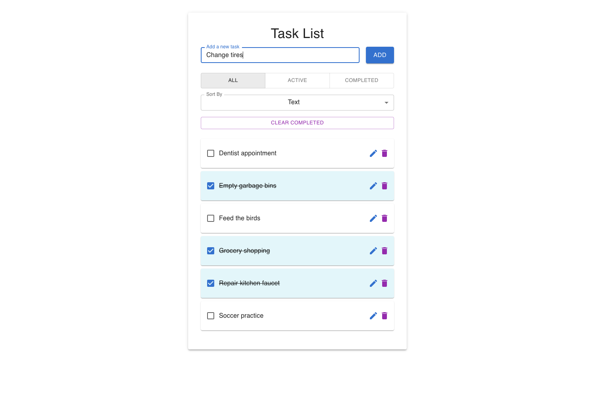

# Task Management App



A simple and intuitive task management application built with React, TypeScript, and Material-UI. This app allows users to create, manage, and organize their tasks efficiently.

## Features

- **Add Tasks**: Quickly add new tasks to your to-do list.
- **Edit Tasks**: Modify existing tasks with ease.
- **Delete Tasks**: Remove tasks that are no longer needed.
- **Filter Tasks**: View tasks based on their status (All, Active, Completed).
- **Sort Tasks**: Organize tasks alphabetically or by completion status.
- **Clear Completed Tasks**: Easily remove all completed tasks from the list.
- **Notifications**: Get immediate feedback on actions performed.
- **Responsive Design**: Works seamlessly across various screen sizes.

## Technologies Used

- **React**: A JavaScript library for building user interfaces.
- **TypeScript**: A typed superset of JavaScript that compiles to plain JavaScript.
- **Material-UI**: A popular React UI framework for building responsive and modern web applications.

## Installation

To set up the project locally, follow these steps:

1. Clone the repository:
   ```bash
   git clone https://github.com/volkanb/task-management-app.git
   ```
2. Navigate into the project directory:
   ```bash
   cd task-management-app
   ```
3. Install the dependencies:
   ```bash
   npm install
   ```

## Usage
1. Start the development server:
   ```bash
   npm start
   ```
2. Open your browser and go to `http://localhost:3000` to view the app.

## Contributing
Contributions are welcome! If you have suggestions or improvements, feel free to open an issue or submit a pull request.

## Acknowledgements
- Inspired by the need for a simple task management tool.
- Thanks to the React and MUI communities for their great resources.
